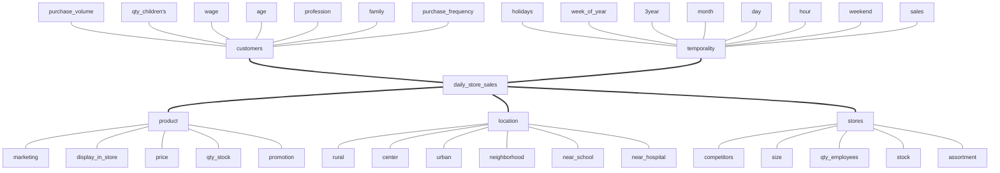

# Rossmann Sales Prediction

 

# Business Problem
This project aims to predict sales for each store for next 6 weeks

 

# data description
## descriptive statistics
### numerical atributes

| Attributes                        | Min       | Max        | Range      | Mean       | Median     | Std        | Skew      | Kurtosis  |
|------------------------------------|-----------|------------|------------|------------|------------|------------|-----------|-----------|
| store                              | 1.00000   | 1115.00000 | 1114.00000 | 558.42973  | 558.00000  | 321.90849  | -0.00095  | -1.20052  |
| day_of_week                        | 1.00000   | 7.00000    | 6.00000    | 3.99834    | 4.00000    | 1.99739    | 0.00159   | -1.24687  |
| sales                              | 0.00000   | 41551.00000| 41551.00000| 5773.81897 | 5744.00000 | 3849.92428 | 0.64146   | 1.77837   |
| customers                          | 0.00000   | 7388.00000 | 7388.00000 | 633.14595  | 609.00000  | 464.41151  | 1.59865   | 7.09177   |
| open                               | 0.00000   | 1.00000    | 1.00000    | 0.83011    | 1.00000    | 0.37554    | -1.75804  | 1.09072   |
| promo                              | 0.00000   | 1.00000    | 1.00000    | 0.38151    | 0.00000    | 0.48576    | 0.48784   | -1.76202  |
| school_holiday                     | 0.00000   | 1.00000    | 1.00000    | 0.17865    | 0.00000    | 0.38306    | 1.67784   | 0.81515   |
| competition_distance               | 20.00000  | 200000.00000| 199980.00000| 5935.44268 | 2330.00000 | 12547.64683| 10.24234  | 147.78971 |
| competition_open_since_month       | 1.00000   | 12.00000   | 11.00000   | 6.78685    | 7.00000    | 3.31109    | -0.04208  | -1.23261  |
| competition_open_since_year        | 1900.00000| 2015.00000 | 115.00000  | 2010.32484 | 2012.00000 | 5.51559    | -7.23566  | 124.07130 |
| promo2                             | 0.00000   | 1.00000    | 1.00000    | 0.50056    | 1.00000    | 0.50000    | -0.00226  | -2.00000  |
| promo2_since_week                  | 1.00000   | 52.00000   | 51.00000   | 23.61903   | 22.00000   | 14.31006   | 0.17872   | -1.18405  |
| promo2_since_year                  | 2009.00000| 2015.00000 | 6.00000    | 2012.79330 | 2013.00000 | 1.66266    | -0.78444  | -0.21008  |
| is_promo                           | 0.00000   | 1.00000    | 1.00000    | 0.15523    | 0.00000    | 0.36212    | 1.90415   | 1.62580   |

### categorical atributes

 

# feature engineering
## hypothesis mindmap

## hypothesis creation

| #   | Hypothesis                                                |
|-----|-----------------------------------------------------------|
| h01 | Stores with larger assortments should sell more           |
| h02 | Stores with closer competitors should sell less           |
| h03 | Stores with longer competitors should sell more           |
| h04 | Stores with active promotions for longer should sell more |
| h05 | Stores with more promotion days should sell more          |
| h07 | Stores with more consecutive promotions should sell more  |
| h08 | Stores open during the Christmas holiday should sell more |
| h09 | Stores should sell more over the years                    |
| h10 | Stores should sell more in the second half of the year    |
| h11 | Stores should sell more after the 10th of each month      |
| h12 | Stores should sell less on weekends                       |
| h13 | Stores should sell less during school holidays            |

 

# exploratory data analysis
## univariate analysis
### response variable

### numerical variable

### categorical variable

## bivariate analysis

| #   | Hypothesis                                                | T / F | Comment                                                                                |
|-----|-----------------------------------------------------------|-------|----------------------------------------------------------------------------------------|
| h01 | Stores with larger assortments should sell more           | False | Stores with a LARGER RANGE sell LESS                                                   |

| #   | Hypothesis                                                | T / F | Comment                                                                                |
|-----|-----------------------------------------------------------|-------|----------------------------------------------------------------------------------------|
| h02 | Stores with closer competitors should sell less           | False | Stores with CLOSER COMPETITORS sell MORE                                               |

| #   | Hypothesis                                                | T / F | Comment                                                                                |
|-----|-----------------------------------------------------------|-------|----------------------------------------------------------------------------------------|
| h03 | Stores with longer competitors should sell more           | False | Stores with COMPETITORS FOR LONGER SELL LESS                                           |

| #   | Hypothesis                                                | T / F | Comment                                                                                |
|-----|-----------------------------------------------------------|-------|----------------------------------------------------------------------------------------|
| h04 | Stores with active promotions for longer should sell more | False | Stores with promotions active for longer sell less after a certain period of promotion |

| #   | Hypothesis                                                | T / F | Comment                                                                                |
|-----|-----------------------------------------------------------|-------|----------------------------------------------------------------------------------------|
| h07 | Stores with more consecutive promotions should sell more  | False | Stores with more consecutive promotions sell less                                      |

| promo | promo2 | sales       |
|-------|--------|-------------|
| 0     | 0      | 1482612096  |
| 0     | 1      | 1289362241  |
| 1     | 0      | 1628930532  |
| 1     | 1      | 1472275754  |

| #   | Hypothesis                                                | T / F | Comment                                                                                |
|-----|-----------------------------------------------------------|-------|----------------------------------------------------------------------------------------|
| h08 | Stores open during the Christmas holiday should sell more | False | Stores open during the Christmas holidays sell less                                    |

| #   | Hypothesis                                                | T / F | Comment                                                                                |
|-----|-----------------------------------------------------------|-------|----------------------------------------------------------------------------------------|
| h09 | Stores should sell more over the years                    | False | Stores sell less over the years                                                        |

| #   | Hypothesis                                                | T / F | Comment                                                                                |
|-----|-----------------------------------------------------------|-------|----------------------------------------------------------------------------------------|
| h10 | Stores should sell more in the second half of the year    | False | Stores sell less in the second half of the year                                        |

| #   | Hypothesis                                                | T / F | Comment                                                                                |
|-----|-----------------------------------------------------------|-------|----------------------------------------------------------------------------------------|
| h11 | Stores should sell more after the 10th of each month      | True  | Stores sell more after the 10th of each month                                          |

| #   | Hypothesis                                                | T / F | Comment                                                                                |
|-----|-----------------------------------------------------------|-------|----------------------------------------------------------------------------------------|
| h12 | Stores should sell less on weekends                       | True  | Stores sell less on the weekend                                                        |

| #   | Hypothesis                                                | T / F | Comment                                                                                |
|-----|-----------------------------------------------------------|-------|----------------------------------------------------------------------------------------|
| h13 | Stores should sell less during school holidays            | True  | Shops sell less during school holidays, except in July and August                      |

## multivariate analysis
### numerical attributes

### categorical attributes

 

# machine learning modelling
## compare model's performance
### real performance (w/ cv)

| Model Name                | MAE CV                | MAPE CV             | RMSE CV              |
|---------------------------|-----------------------|---------------------|----------------------|
| Linear Regression         | 2079.28 +/- 303.04    | 0.3 +/- 0.02        | 2961.07 +/- 473.32   |
| Lasso                     | 2116.98 +/- 342.05    | 0.29 +/- 0.01       | 3059.41 +/- 504.65   |
| Random Forest Regressor   | 841.36 +/- 222.68     | 0.12 +/- 0.02       | 1259.23 +/- 326.41   |
| XGBoost Regressor         | 1864.15 +/- 293.43    | 0.25 +/- 0.01       | 2688.77 +/- 431.9    |

 

# performance metrics
## business performance
| store | predictions    | worst_scenario   | best_scenario    | MAE        | MAPE    |
|-------|----------------|------------------|------------------|------------|---------|
| 291   | 105895.02344   | 102499.59128     | 109290.45559     | 3395.43215 | 0.59849 |
| 908   | 230467.76562   | 222715.11018     | 238220.42107     | 7752.65544 | 0.51972 |
| 594   | 338323.15625   | 333163.97136     | 343482.34114     | 5159.18489 | 0.35672 |
| 262   | 209670.56250   | 208348.83738     | 210992.28762     | 1321.72512 | 0.31361 |
| 875   | 194667.82812   | 190671.90146     | 198663.75479     | 3995.92666 | 0.31338 |

## total performance
## machine learning performance

