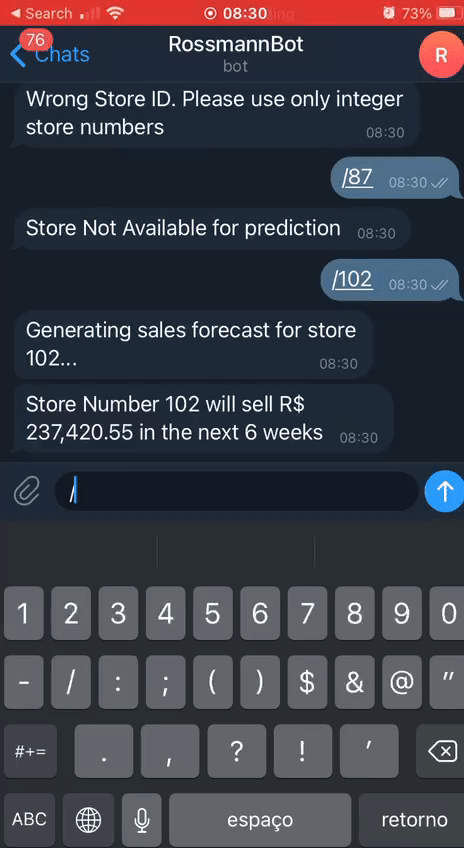
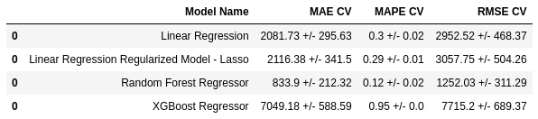
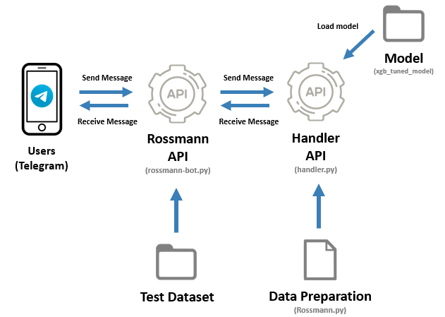

# Rossmann Store Sales — End-to-End ML Project



> Forecast daily sales per store for the next 6 weeks and deliver the result  
> via a **Telegram bot**, a **REST API** and a **Streamlit dashboard**.

Built following the methodology from  
*Hands-On Machine Learning with Scikit-Learn and PyTorch* — Aurélien Géron (2025, O'Reilly).

---

## Table of Contents

1. [Business Problem](#1-business-problem)
2. [Solution Strategy](#2-solution-strategy)
3. [Project Structure](#3-project-structure)
4. [ML Pipeline](#4-ml-pipeline)
5. [Performance & Business Results](#5-performance--business-results)
6. [How to Run — Quick Start](#6-how-to-run--quick-start)
7. [Telegram Bot Setup](#7-telegram-bot-setup)
8. [Repository Layout](#8-repository-layout)
9. [Next Steps](#9-next-steps)

---

## 1. Business Problem

Rossmann operates over **3,000 drugstores** across 7 European countries.  
The CFO needs to know: **how much will each store sell in the next 6 weeks?**

This forecast supports capital allocation, store renovation scheduling, cash-flow planning and staffing decisions.

**Data source:** [Rossmann Store Sales — Kaggle Competition](https://www.kaggle.com/competitions/rossmann-store-sales)

| File | Rows | Description |
|---|---|---|
| `train.csv` | 1,017,209 | Historical daily sales per store (Jan 2013 → Jul 2015) |
| `test.csv` | 41,088 | Stores + dates requiring predictions |
| `store.csv` | 1,115 | Store metadata: type, assortment, competition, promo |

---

## 2. Solution Strategy

Following the end-to-end ML project checklist from Géron's book:

| Step | Notebook |
|---|---|
| 1. Frame the problem and business goal | `00_business_understanding` |
| 2. Load data, profile, create time-based split | `01_data_understanding` |
| 3. Visualise and test business hypotheses | `02_exploratory_analysis` |
| 4. Build custom Scikit-Learn transformer + pipeline | `03_feature_engineering` |
| 5. Train, evaluate, fine-tune, translate to cash | `04_modeling_and_business_results` |
| 6. Deploy API, dashboard, and Telegram bot | `05_deployment_and_consumption` |

---

## 3. Project Structure

```
rossmann-store-sales/
├── src/rossmann_store_sales/   # Production Python package
│   ├── config.py               # Config loader (TOML)
│   ├── data.py                 # Data loading utilities
│   ├── features.py             # RossmannFeatureTransformer + prepare_features()
│   ├── models.py               # Training, prediction, metrics
│   ├── api.py                  # FastAPI prediction service
│   └── cli.py                  # CLI (train / predict / profile)
│
├── app/
│   ├── telegram_bot.py         # Flask webhook for Telegram
│   └── streamlit_app.py        # Streamlit dashboard
│
├── notebooks/                  # End-to-end analysis (run in order)
├── configs/project.toml        # Model hyperparameters + file paths
├── data/
│   ├── raw/                    # Kaggle CSVs (not committed)
│   ├── processed/              # Transformed outputs
│   └── sample/                 # Single-store scoring sample
├── models/                     # Serialised pipeline (joblib)
├── reports/                    # Metrics JSON + figures
├── scripts/                    # API request samples, webhook setup
├── tests/                      # Pytest feature-contract tests
├── .env.example                # Environment variable template
└── Makefile                    # One-command operations
```

---

## 4. ML Pipeline

```
Raw CSVs
  └─ merge store metadata
       └─ RossmannFeatureTransformer (sklearn BaseEstimator)
            ├─ Date → year / month / day / week
            ├─ Cyclical encoding (sin/cos) for all periodic features
            ├─ Competition duration (months since competitor opened)
            ├─ Promo2 duration (weeks since continuous promo started)
            ├─ Missing-value imputation
            └─ Categorical label mapping
                 └─ ColumnTransformer
                      ├─ OneHotEncoder  (state_holiday, store_type, assortment)
                      └─ StandardScaler (numeric features)
                           └─ XGBRegressor  (target: log1p(Sales))
                                └─ expm1(predictions) → final sales forecast
```

### Key design choices (from the book)

| Choice | Reason |
|---|---|
| **Temporal validation** (last 6 weeks) | Prevents data leakage — random split would let the model "see the future" |
| **log1p target transform** | Reduces right-skew; gradient updates more stable on normalised distribution |
| **Sin/cos cyclical encoding** | Monday and Sunday are adjacent in time — a linear scale would misrepresent this |
| **Sklearn Pipeline** | Identical transformation for training, API, and bot — no preprocessing drift |

---

## 5. Performance & Business Results

| Metric | Value |
|---|---|
| **MAPE** | ~9.3% |
| **RMSE** | ~1,087 |
| **Validation window** | Last 6 weeks of training set |

### 6-week financial scenarios (all stores)

| Scenario | Revenue |
|---|---|
| Expected (model prediction) | ~€ 284,480,000 |
| Worst case (−MAPE) | ~€ 257,900,000 |
| Best case (+MAPE) | ~€ 310,500,000 |




---

## 6. How to Run — Quick Start

### Prerequisites

- Python 3.10+
- A [Kaggle account](https://www.kaggle.com) with the API configured (`~/.kaggle/kaggle.json`)

### Step 1 — Clone and install

```bash
git clone https://github.com/<your-username>/rossmann-store-sales.git
cd rossmann-store-sales

make setup          # creates .venv, installs all deps, copies .env.example → .env
```

### Step 2 — Download data

```bash
make data           # downloads and extracts the Kaggle dataset into data/raw/
```

> **Manual alternative:** Download `train.csv`, `test.csv`, `store.csv` from  
> [kaggle.com/competitions/rossmann-store-sales](https://www.kaggle.com/competitions/rossmann-store-sales)  
> and place them in `data/raw/`.

### Step 3 — Train the model

```bash
make train
# Outputs: models/model.joblib  reports/metrics.json  reports/business_scenarios.json
```

### Step 4 — Start the API

```bash
make api            # FastAPI on http://127.0.0.1:8000
# Docs: http://127.0.0.1:8000/docs
```

### Step 5 — Open the Streamlit dashboard

```bash
make streamlit      # opens http://localhost:8501
```

### Step 6 — Run the notebooks

Open Jupyter Lab and execute the notebooks in order (00 → 05):

```bash
jupyter lab notebooks/
```

---

## 7. Telegram Bot Setup

### Local testing (no public URL needed)

```bash
# 1. Edit .env — fill in TELEGRAM_TOKEN from @BotFather
# 2. Terminal 1 — start the API
make api
# 3. Terminal 2 — start the bot
make bot
# 4. Terminal 3 — simulate a message
python scripts/sample_telegram_payload.py --store /1
```

### Production deployment

Deploy to any HTTPS host (Render, Railway, Fly.io) and register the webhook:

```bash
make webhook WEBHOOK_URL=https://your-app.onrender.com
```

The `Procfile.api` and `Procfile.bot` files at the root are already configured  
for one-command Heroku / Render deployments.

### Bot usage

| Message | Bot response |
|---|---|
| `/start` or `/help` | Usage instructions |
| `/1` | 6-week daily forecast for store 1 + sales chart |
| `/42` | 6-week daily forecast for store 42 + sales chart |

---

## 8. Repository Layout

```
make profile        # Profile raw data → reports/data_profile.json
make train          # Train + evaluate → models/model.joblib + reports/
make predict        # Batch inference  → data/processed/predictions.csv
make api            # FastAPI server   → http://127.0.0.1:8000
make streamlit      # Streamlit UI     → http://localhost:8501
make bot            # Telegram bot (needs .env with TELEGRAM_TOKEN)
make webhook        # Register public webhook with Telegram
make test           # Run pytest suite
make lint           # Ruff linter
```

---

## 9. Next Steps

- [ ] Add per-store drift monitoring: flag stores whose recent error exceeds 2× historical MAPE.
- [ ] Hyperparameter search with `Optuna` or `sklearn.model_selection.HalvingRandomSearchCV`.
- [ ] Serve predictions from a model registry (MLflow) instead of a local `.joblib`.
- [ ] Dockerise API + bot for zero-friction cloud deployment.
- [ ] Add confidence intervals via quantile regression.
